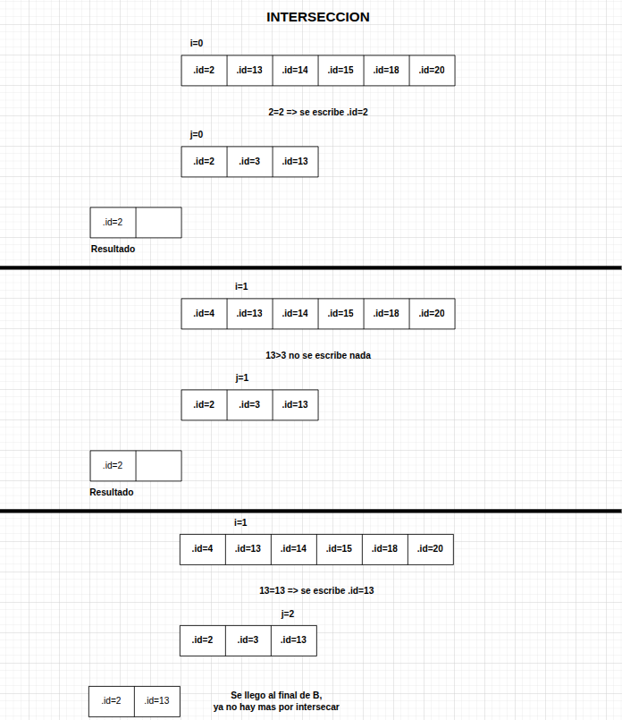

<div align="right">

</div>

# TP1 LECTURA DE ARCHIVOS

## Alumno: Puchetta Federico - 112853 - fpuchetta@fi.uba.ar

- Para compilar junto a main:

```bash
make tp1
```

- Para compilar junto a pruebas de usuario:

```bash
make pruebas
```

- Para ejecutar:

```bash
./tp1 <comandos>
```

- Para limpiar archivos:

```bash
make clean
```

---

<div align="center">
  <h2><strong>Funcionamiento</strong></h2>
</div>

### Eleccion de estructuras:

Para la realizacion del Trabajo Practico tuve que crear varias estructuras a lo largo del trabajo, pero en la cual se basa casi la totalidad del mismo es en base a la estructura **tp1_t**, la cual consta de un vector de punteros a pokemones y 2 campos numericos, para mantener la capacidad maxima del vector y la cantidad ocupada de ese maximo.

Si se respeta las firmas de funciones y se utiliza el tp1_t con sus propias funciones, la memoria distribuida luego de crear una estructura en memoria se veria distribuida de la siguiente forma:

<div align="center">

</div>

Luego, para lograr implementar las funcionalidades pedidas en el main.c, cree la estructura **comando_t** la cual posee un puntero a una funcion de comando y el nombre del mismo, de esta manera se puede filtrar cada comando por su nombre de ejecucion y llamar a la funcion correspondiente que lo ejecute.

Por ultimo, para la funcionalidad de lectura de csv opte por crear el TDA **archivo_t** el cual se encarga de abrir un archivo, leerlo, sacar el salto de linea por cada linea y luego cerrarlo sin perdida de memoria.

Esta estructura cuenta con un FILE* al archivo para no perder la referencia al mismo, un campo de la linea leida en cuestion, el tamanio de dicha linea, la cantidad de lineas leidas en total del archivo y si se llego al EOF.

### Flujo de trabajo:

Para utilizar el tp se debe crear primero con **tp1_leer_archivo** para luego poder utilizar cada funcion correspondiente y trabajar con la estructura con los pokemones cargados del csv.

Esta funcion se encarga de reservar en memoria la estructura previamente explicada (tp1_t) y completar el vector de pokemones con el csv proporcionado mediante la implementacion del otro tda (archivo_t) para finalmente ordenarlo en orden ascendente segun su id. En caso de error, dicha funcion se encarga de liberar la memoria correspondiente sin tener fugas de memoria.

---

## Respuestas teóricas:

 - Explicar la elección de la estructura para implementar la funcionalidad pedida. Justifique el uso de cada uno de los campos de la estructura.

Como explique previamente, mi estructura tp1_t consta de un campo de **puntero doble** a struct pokemon el cual representa el contenedor de pokemones, esta decisión (puntero doble) permite que operaciones como “mostrar” y el ordenamiento se implementen intercambiando punteros en lugar de copiar estructuras completas (la de pokemon_t), reduciendo significativamente las copias de memoria y mejorando el rendimiento práctico sin cambiar la complejidad asintótica.

Luego, el campo de **capacidad** es implementado para poder lograr una complejidad amortizada a la hora de reservar memoria para nuestro vector de pokemones. De esta forma, puedo **doblar** el espacio de memoria a la hora de que se llene el vector y reducir la cantidad de llamadas a realloc (el cual tiene una complejidad lineal).

Por ultimo, el campo **cantidad_pokemones** permite diferenciar esta cantidad reservada de memoria de la cantidad real utilizada del vector, logrando tener un indice maximo para la iteracion interna. A su vez, logra que sea constante la complejidad de la funcion **tp1_cantidad**.

---

 - Justificar la complejidad computacional temporal de **cada una** de las funciones que se piden implementar.

#### Funcion `tp1_t *tp1_leer_archivo(const char *nombre)`:

Como explique en pocas palabras al principio, esta funcion se encarga de crear la estructura en memoria del tp.

Para analizar la complejidad de esta funcion, se toma como **tamanio del problema** a la cantidad de lineas del csv, es decir, la cantidad de pokemones que tendra el tp. De esta forma, se obtiene que **la complejidad computacional es O(n^2)** ya que lee todo el archivo linea por linea, es decir n veces, parsea cada una (ignorando funciones como sscanf, strcmp, strchr debido a que no toman como variable de analisis la cantidad de lineas, sino el largo de las mismas) y para cada linea, se fija si el pokemon habia sido insertado previamente, teniendo que hacer una busqueda lineal debido a que todavia los pokemones no se encuentran ordenados. Por ultimo, se le suma la complejidad computacional de ordenar el vector, el cual fue implementado por un bubble sort generico (complejidad lineal).

El flujo de trabajo de dicha funcion se puede analizar en el siguiente diagrama:

<div align="center">

</div>

#### Funcion `size_t tp1_cantidad(tp1_t *tp1)`:
    
Esta funcion posee una **complejidad computacional de O(1)** debido al campo previamente explicado de tp1_t ``cantidad_pokemones``.

#### Funcion `tp1_guardar_archivo(tp1_t *tp1, const char *nombre)`:

Esta funcion se puede analizar al igual que la primera, tomando como **tamanio del problema** a la cantidad de pokemones de la estructura. De esta forma, se analiza que **la complejidad computacional de esta funcion es O(n)** ya que se encarga de parsear cada pokemon en un string con el formato pedido, lo cual es ignorado para el analisis debido a que no toma la misma variable para sus analisis de complejidad (cantidad de pokemones) y luego por cada linea se escribe en el archivo mediante la funcion **archivo_escribir_linea** la cual posee una complejidad computacional lineal en funcion del largo de cada linea. De esta forma la complejidad quedaria O(n.m^2), siendo M el largo de cada linea y N la cantidad de lineas, pero como tomamos como variable de analisis la N, la complejidad queda lineal.

El flujo de trabajo de dicha funcion se puede analizar en el siguiente diagrama:

<div align="center">

</div>

#### Funciones `tp1_t *tp1_union/interseccion/diferencia(tp1_t *un_tp, tp1_t *otro_tp)`:

Las 3 funciones de operaciones de conjuntos resultan con una **complejidad lineal de la suma de variables de analisis O(n+m)**. Esto es asi debido a que cada tp pasado por parametro si se respeto el uso del tda y fue creado con `tp1_leer_archivo` vienen previamente ordenados, reduciendo de manera significativa la cantidad de comparaciones para cada operacion ya que no hay que comparar cada elemento de un tp con cada del otro, simplemente se deben recorrer ambos al mismo tiempo con distintos indices e ir avanzando en funcion de la comparacion que estemos realizando y el orden generico de cada uno de ellos.

El flujo de trabajo de dichas funciones se puede analizar en el siguiente diagrama:

<div align="center">



</div>

#### Funcion `struct pokemon *tp1_buscar_nombre(tp1_t *tp, const char *nombre)`:

El analisis de complejidad de esta funcion toma como analisis nuevamente la cantidad de pokemones de la estructura pasada por parametro, de esta forma se puede decir que **la complejidad de la funcion es O(n)**. Se llega a esta conclusion debido a que al no tener garantizado que nuestro vector vendra ordenado de manera alfabetica, no se puede realizar una busqueda binaria (sin la creacion de otro vector en la estructura para un segundo orden de indices) y nos queda hacerlo de manera lineal, prohibiendo reducir la complejidad a su forma logaritmica.

#### Funcion `struct pokemon *tp1_buscar_id(tp1_t *tp, int id)`:

El analisis de complejidad de esta funcion toma como analisis nuevamente la cantidad de pokemones de la estructura pasada por parametro, de esta forma se puede decir que **la complejidad de la funcion es O(log(n))**. En este caso, como se menciono previamente, nuestra estructura siempre es creada con un **orden ascendente por id**, permitiendo en esta ocasion hacer una busqueda binaria y reducir significativamente la cantidad de pasadas a realizar para encontrar el pokemon pedido.

El flujo de trabajo de dich funcion se puede analizar en el siguiente diagrama:

<div align="center">

</div>

#### Funcion `size_t tp1_con_cada_pokemon(tp1_t *un_tp, bool (*f)(struct pokemon *, void *), void *extra)`:

Para analizar a esta funcion basta con ver el nombre de la misma, la cual indica que se aplica a `cada_pokemon`, entonces nos deja en claro que la variable de analisis sera tomada en funcion de la cantidad de pokemones en la estructura. De esta forma, se llega a la conclusion de que **la complejidad computacional de la misma es O(n)** ya que simplemente recorre cada uno de los pokemones, y le aplica la funcion pasada por parametro a cada uno de ellos.

#### Funcion `void tp1_destruir(tp1_t *tp1)`:

**La complejidad de esta funcion es O(n)**, siendo N la cantidad de pokemones. Se encarga de hacer una accion constante (free) a cada campo de la estructura y a cada pokemon del vector.

----

 - Explique qué dificultades tuvo para implementar las funcionalidades pedidas en el main (si tuvo alguna) y explique si alguna de estas dificultades se podría haber evitado modificando la definición del .h

 A la hora de aplicar las funcionalidades pedidas en main.c, encontre una dificultad a la hora de `mostrar_por_nombre`, debido a que no poseiamos una forma de iterar los pokemones de manera alfabetica. Para solucionar este inconveniente, opte por la creacion de la estructura `recolector_t` la cual me permite llamar a la funcion que recorre cada pokemon y le aplica una funcion, para utilizar de contexto dicho recolector y guardar en un vector temporal referencias a cada uno de los punteros de los pokemones, para luego poder ordenar dicho vector y imprimirlos alfabeticamente.

 Este inconveniente se podria haber evitado modificando la firma de la funcion `tp1_con_cada_pokemon`, aniadiendo un campo mas llamado **modo_recorrido** (o similar), el cual permitiera elegir de que forma se puede recorrer el vector de pokemones y lograr imprimirlos alfabeticamente siplemente llamando a dicha funcion.

